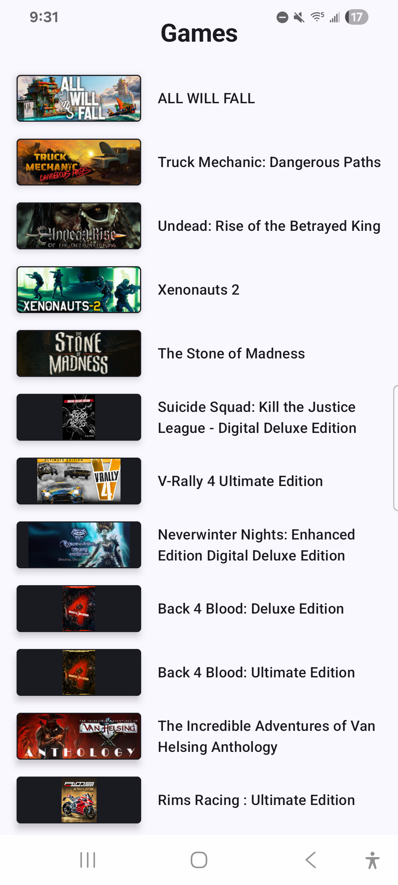
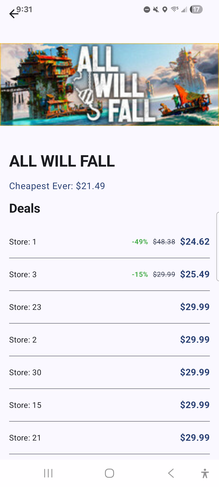
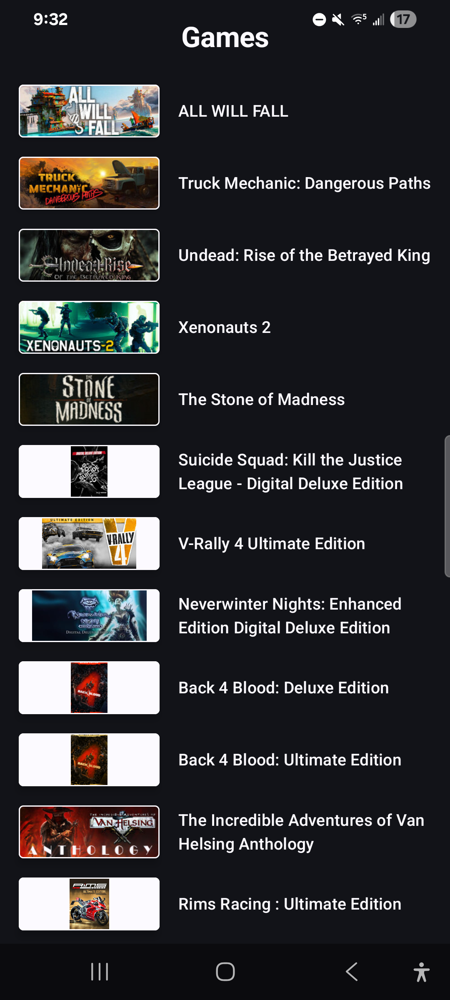
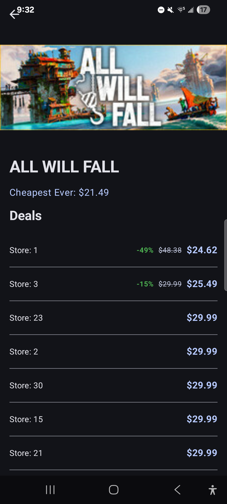

# CheapShark Games Android App

A simple Android application that uses the [CheapShark API](https://apidocs.cheapshark.com/) to display a list of game deals and detailed information for each game.

## Features

- **Game List**: Displays a list of games including thumbnails and names.
- **Game Details**: Show additional information about a specific game, including the cheapest price ever and all currently available deals across different stores.
- **Clean Architecture**: Organized into data, domain, and presentation layers for better maintainability and testability.
- **MVI Pattern**: Uses the Model-View-Intent pattern for predictable state management in the presentation layer.
- **Jetpack Compose**: Modern UI toolkit for building a responsive and aesthetically pleasing user interface.

## Screenshots

#### Game List & Game Detail - Light Mode

#### Game List & Game Detail - Dark Mode

## Tech Stack

- **Kotlin**: Primary programming language.
- **Jetpack Compose**: For UI development.
- **Hilt**: Dependency injection.
- **Retrofit**: Networking for consuming the CheapShark API.
- **Kotlinx Serialization**: For JSON parsing.
- **Coil**: Image loading.
- **Navigation Compose**: For app navigation.
- **Coroutines & Flow**: For asynchronous programming and reactive data streams.

## Project Structure

- `core`: Shared utilities, DI modules, and common classes.
- `gamedeal`: Feature-specific logic for game deals.
    - `data`: API definitions, DTOs, mappers, and repository implementations.
    - `domain`: Core business logic including models, repository interfaces, and use cases.
    - `presentation`: UI state, intents, ViewModels, and Compose screens.

## Assumptions and Notes

- **Game List Source**: The `/deals` API is used to populate the initial game list. This was chosen over the `/games` API because it requires a title query, while `/deals` provides a rich list of games.
- **Data De-duplication**: The Deals API often returns multiple deals for the same game. The `GameRepositoryImpl` uses `distinctBy { it.gameID }` to ensure the user sees a unique list of games rather than redundant entries.
- **Pagination support**: There is an opportunity to implement pagination for the Deals API to improve scalability when displaying games. Due to time constraints, this was not implemented but can be added.
- **Edge case handling (Deals API)**: In certain scenarios, applying a uniqueness filter on the initial page may result in very few games being displayed. This case is not currently handled but can be addressed with additional logic.
- **Screenshots**: App screenshots are added in `/screenshots` folder for your reference

## Getting Started

1. Clone the repository.
2. Open the project in Android Studio (Ladybug or newer recommended).
3. Build and run the app on an emulator or physical device.
